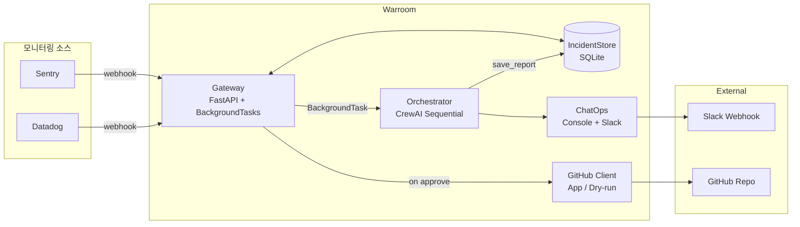
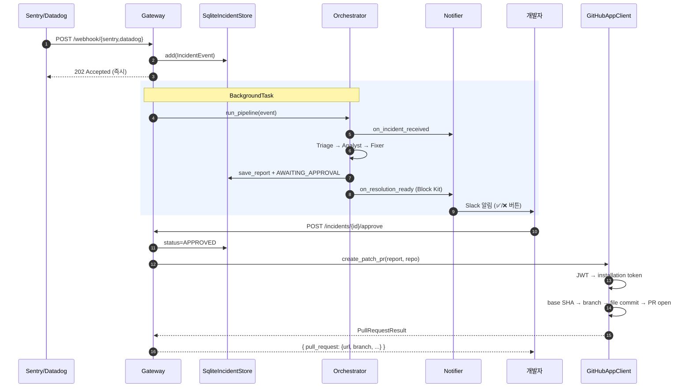

# Architecture

> 본 문서는 **현재 구현된 구조** 를 설명한다. 장기 비전·사용자 시나리오·단계별 구현 계획은 [`plan.md`](./plan.md) 참고.

## 개요

Sentry/Datadog 의 webhook 을 시작점으로, 3개의 AI 에이전트가 순차 협업하여 근본 원인 분석 → 패치 제안까지 자동화. 개발자 승인 후 GitHub App 이 PR 을 자동 생성한다.

## 컴포넌트



## 처리 흐름 (수신 → PR 생성)



## 패키지 구조

```
packages/
├── common/          # 공유 모델 (IncidentEvent, ResolutionReport, Severity, Status)
│
├── gateway/         # Event Gateway
│   ├── main.py      # FastAPI 엔드포인트 (webhook, incidents, approve/reject)
│   ├── store.py     # IncidentStore (Async SQLAlchemy 2.0)
│   ├── security.py  # webhook 서명 검증 (Sentry HMAC, Datadog token)
│   ├── db/
│   │   ├── models.py    # SQLAlchemy Base, Incident, Report
│   │   └── session.py   # AsyncEngine + AsyncSession factory
│   └── parsers/
│       ├── sentry.py
│       └── datadog.py
│
├── orchestrator/    # Multi-Agent Pipeline
│   ├── agents.py    # Triage / Analyst / Fixer (LLM provider 주입)
│   ├── runner.py    # Crew 조립, mock/real 분기
│   ├── llm.py       # Gemini / Anthropic / Ollama 추상화
│   └── tools/       # Sentry / GitHub lookup (현재 mock)
│
├── chatops/         # Notifier
│   ├── base.py
│   ├── console.py
│   ├── slack.py     # Block Kit + Incoming Webhook (dry-run 폴백)
│   └── factory.py   # WARROOM_NOTIFIER=console|slack|both
│
└── github/          # PR 자동 생성
    ├── base.py      # GitHubClient Protocol + PullRequestResult
    ├── app.py       # GitHub App (JWT → installation token → REST)
    ├── dry_run.py   # 페이로드/마크다운 파일 출력 (App 미설정 시)
    ├── report.py    # ResolutionReport → markdown / PR title/body
    └── factory.py   # make_github_client()
```

## 확장 포인트

| 항목 | 위치 | 방법 |
|------|------|------|
| Sentry SaaS 실 webhook | `gateway/parsers/sentry.py` | 서명 검증 추가 |
| Slack 실 송신 | `.env` `SLACK_WEBHOOK_URL` 설정 | URL 있으면 자동 송신, 없으면 dry-run |
| GitHub App 실 PR | `.env` `GITHUB_APP_*` + `GITHUB_REPO` | App 설치 후 credentials 채움 |
| Jira 티켓 생성 | `gateway.main._handle_decision` approve 분기 | GitHub PR 옆에 추가 |
| 멀티 레포 매핑 | `gateway.main._open_pr` | service → repo YAML 매핑 (현재 단일 `GITHUB_REPO`) |
| 실 LLM 호출 | `.env` `MOCK_PIPELINE=false` + provider key | Gemini Free / Anthropic |
| 실 Sentry/GitHub Tool | `orchestrator/tools/{sentry,github}.py` | mock 함수 교체 |

## 비기능 요구사항

- Webhook 수신 후 **1초 이내 202 반환** (BackgroundTasks 분리)
- 외부 API 실패 시 크래시 없이 dry-run 폴백 (Slack, GitHub 모두)
- API Key/Private Key 는 `.env` / `.secrets/` 만, 코드 하드코딩 금지
- DB: dev/prod = MySQL (docker-compose), test/ci = in-memory SQLite. `DATABASE_URL` 환경변수 분기. 스키마 변경은 Alembic revision 으로
- Fixer 출력 코드는 PR 본문에 첨부되며 자동 merge 없음 (HITL 필수)
