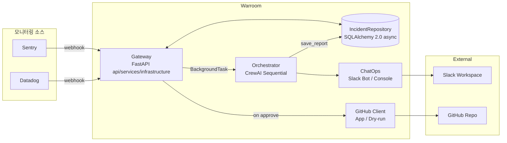
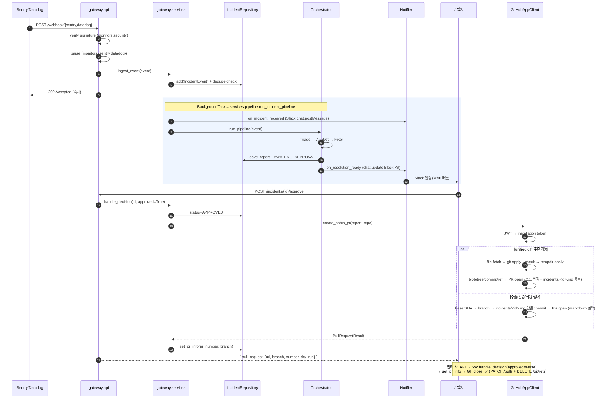

# Architecture

> 본 문서는 **현재 구현된 구조** 를 설명한다. 코드 작성 룰 (layer/import/naming) 은 [`.claude/rules/layering.md`](../.claude/rules/layering.md), 장기 비전·구현 계획은 [`plan.md`](./plan.md) 참고.

## 개요

Sentry/Datadog 의 webhook 을 시작점으로, 3개의 AI 에이전트가 순차 협업하여 근본 원인 분석 → 패치 제안까지 자동화. 개발자 승인 후 GitHub App 이 PR 을 자동 생성한다.

## 컴포넌트



## 처리 흐름 (수신 → PR 생성)



## 패키지 구조

```
packages/
├── common/                       # 공유 모델 + 표준 시간 + 보안 helper
│   ├── models.py                 # IncidentEvent, ResolutionReport, Severity, Status (StrEnum)
│   ├── clock.py                  # APP_TZ + now() — 모든 timestamp 의 단일 소스
│   ├── diff.py                   # extract/changed_paths/is_new_file/verify_apply/apply_diff
│   └── redact.py                 # 9개 secret 패턴 redaction (LLM 출력 → consumption 지점)
│
├── gateway/                      # Event Gateway (3-layer)
│   ├── main.py                   # composition root — FastAPI app + lifespan + include_router
│   ├── api/                      # presentation
│   │   ├── webhooks.py           #   /webhook/{sentry,datadog}
│   │   └── incidents.py          #   /incidents (list/get/approve/reject)
│   ├── services/                 # application — usecase
│   │   ├── ingest.py             #   dedupe + 백그라운드 트리거
│   │   ├── pipeline.py           #   파이프라인 실행 + slack 브리지 (sync↔async)
│   │   ├── incidents.py          #   read query (list/get)
│   │   └── decisions.py          #   approve/reject + PR 트리거
│   └── infrastructure/           # 외부 IO / 영속화
│       ├── db/
│       │   ├── models.py         #   SQLAlchemy Base, Incident, Report
│       │   ├── session.py        #   AsyncEngine + AsyncSession factory
│       │   └── repository.py     #   IncidentRepository (Async)
│       └── monitors/             # 모니터링 도구 어댑터
│           ├── sentry.py         #   webhook payload → IncidentEvent
│           ├── datadog.py
│           └── security.py       #   webhook 서명 검증 (HMAC, token)
│
├── orchestrator/                 # Multi-Agent Pipeline
│   ├── agents.py                 # Triage / Analyst / Fixer (LLM provider 주입)
│   ├── runner.py                 # Crew 조립, mock/real 분기
│   ├── llm.py                    # Gemini / Anthropic / Ollama 추상화
│   └── tools/                    # Sentry / GitHub lookup (현재 mock — Phase 6.2)
│
├── chatops/                      # Notifier
│   ├── base.py
│   ├── console.py
│   ├── slack.py                  # Bot Token + chat.postMessage + thread + chat.update
│   └── factory.py                # WARROOM_NOTIFIER=console|slack|both
│
└── github/                       # PR 자동 생성
    ├── base.py                   # GitHubClient Protocol + PullRequestResult
    ├── app.py                    # GitHub App (JWT → installation token → REST)
    │                             #   create_patch_pr: unified diff hybrid + markdown 폴백
    │                             #   close_pr: 반려 시 PR close + branch 삭제
    ├── dry_run.py                # 페이로드/마크다운 파일 출력 (App 미설정 시)
    ├── report.py                 # ResolutionReport → markdown / PR title/body (patch redact at render)
    └── factory.py                # make_github_client()
```

## 확장 포인트

| 항목 | 위치 | 방법 |
|------|------|------|
| 새 모니터링 소스 (PagerDuty 등) | `gateway/infrastructure/monitors/<name>.py` + `gateway/api/webhooks.py` 에 router | parse() + verify_signature() 두 함수만 |
| Slack 실 송신 | `.env` `SLACK_BOT_TOKEN` 설정 | 토큰 있으면 chat.postMessage, 없으면 dry-run JSONL |
| GitHub App 실 PR | `.env` `GITHUB_APP_*` + `GITHUB_REPO` | App 설치 후 credentials 채움 |
| Jira 티켓 생성 | `gateway/services/decisions.py` approve 분기 | GitHub PR 옆에 추가 |
| 멀티 레포 매핑 | `gateway/services/decisions.py` `_open_pr` | service → repo YAML 매핑 (현재 단일 `GITHUB_REPO`) |
| 실 LLM 호출 | `.env` `MOCK_PIPELINE=false` + provider key | Gemini Free / Anthropic |
| 실 Sentry/GitHub Tool | `orchestrator/tools/{sentry,github}.py` | mock 함수 교체 (Phase 6.2) |

## 비기능 요구사항

- Webhook 수신 후 **1초 이내 202 반환** (BackgroundTasks 분리)
- 외부 API 실패 시 크래시 없이 dry-run 폴백 (Slack, GitHub 모두)
- API Key/Private Key 는 `.env` / `.secrets/` 만, 코드 하드코딩 금지
- DB: dev/prod = MySQL (docker-compose), test/ci = in-memory SQLite. `DATABASE_URL` 환경변수 분기. 스키마 변경은 Alembic revision
- 스키마 초기화: SQLite 면 lifespan/demo 가 `metadata.create_all` 자동 실행, MySQL 이면 자동 셋업 비활성 — `alembic upgrade head` 가 운영 진입의 전제 조건
- Fixer 출력 코드는 PR 본문에 첨부되며 자동 merge 없음 (HITL 필수)
