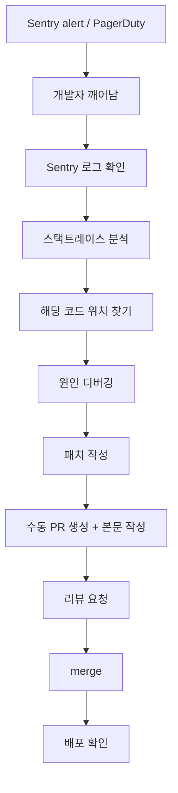
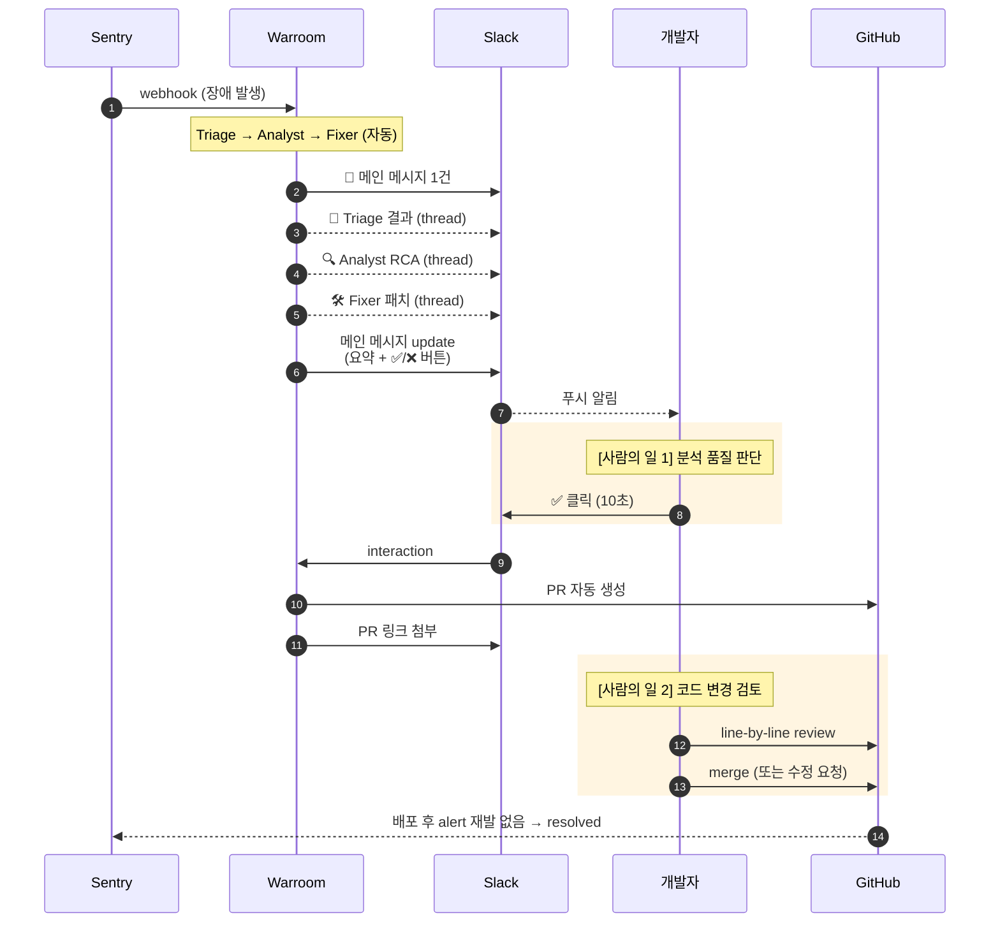
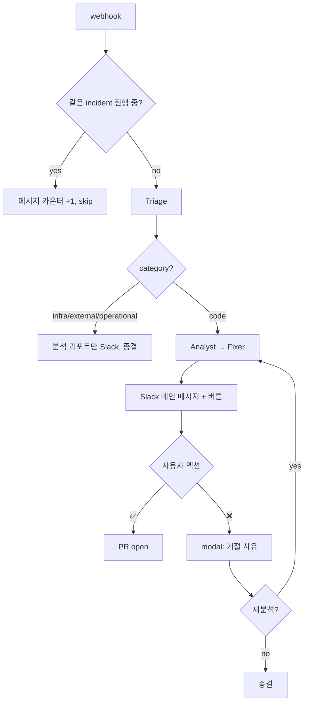
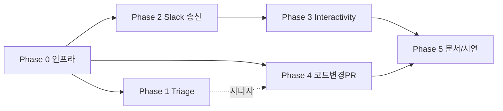

# Warroom 구현 플랜

> 장애 자동 대응 시스템의 최종 비전, 사용자 시나리오, 현재 구조에서 변경 필요한 부분, 단계별 작업 계획.
>
> 최초 작성: 2026-05-13 / 갱신 정책: Phase 완료 시마다 진행 상태 업데이트.

---

## 1. 목적

장애 발생 → 알림 → 분석 → 패치 → 승인 → 배포까지 자동화하되, **사람의 일을 "판단" 두 번으로 제한**한다.

1. **분석 품질 판단** — _"AI 분석이 그럴듯한가?"_ (Slack ✅/❌, 10초)
2. **코드 변경 검토** — _"이 코드 변경이 안전한가?"_ (GitHub PR review, 수 분)

코드 작성·RCA 문서화·PR 본문 작성·배포 트리거는 모두 자동.

---

## 2. 사용자 시나리오 (자동화 완료 후)

### 2.1 Before — 기존 수동 대응

사람 작업 시간: **30분 ~ 수 시간** (코드/RCA/PR 본문 모두 사람 몫).

### 2.2 After — Warroom 자동화

### 2.3 시간축 / 책임 분리

| 시점 | 누가 | 무엇 | 자동/수동 |
|---|---|---|---|
| T+0s | Sentry | 장애 감지 | 자동 |
| T+1s | Gateway | webhook 수신, 202 응답 | 자동 |
| T+5s | Slack | 메인 알림 메시지 | 자동 |
| T+10~60s | Orchestrator → Slack | 에이전트 분석 (thread 진행 표시) | 자동 |
| T+60~90s | Slack | 메인 메시지 update (버튼 추가) | 자동 |
| T+? | **개발자** | **Slack ✅/❌ 클릭** | **수동 (10초)** |
| +5s | GitHub | PR 자동 생성 | 자동 |
| T+? | **개발자** | **GitHub PR 리뷰 + merge** | **수동 (~수 분)** |
| +배포 시간 | CI/CD | 배포 | 자동 (Actions) |
| +N분 | Warroom | metric 회복 확인 → resolved | 자동 (M4+ 범위) |

### 2.4 분기 처리 (edge case)

---

## 3. 현재 구조에서 변경 필요한 부분

| # | 시나리오 단계 | 현재 구현 | 변경 필요 | 변경 위치 | Phase |
|---|---|---|---|---|---|
| 1 | 장애 webhook 수신 | `/webhook/{sentry,datadog}` 동작 | dedupe (fingerprint) 추가 | `gateway/store.py`, `main.py` | 1.1 |
| 2 | Triage 분류 | severity 만 | `category` 필드 추가 (code/infra/external/operational) | `common/models.py`, `orchestrator/agents.py` prompt, `runner.py` 파싱 | 1.2 |
| 3 | infra/external 분기 | Fixer 까지 항상 진행 | category != code 시 Fixer skip, 분석 리포트만 알림 | `orchestrator/runner.py` | 1.3 |
| 4 | Slack 메인 메시지 송신 | Incoming Webhook (단방향) | Web API (`chat.postMessage`, Bot Token) | `chatops/slack.py` 재작성 | 2.1 |
| 5 | 에이전트 진행 표시 | `on_agent_update` 가 Slack 무시 | thread reply 로 표시 | `chatops/slack.py` | 2.2 |
| 6 | 최종 결과 메시지 | 신규 메시지 1건 | 메인 메시지 `chat.update` + 버튼 | `chatops/slack.py` | 2.3 |
| 7 | thread_ts 보관 | 없음 | IncidentStore 에 컬럼 추가 | `gateway/store.py` schema | 2.4 |
| 8 | Slack 버튼 클릭 | 시각적으로만 존재 | `/slack/interactions` endpoint (서명 검증) | `gateway/main.py` 신규 | 3.2 |
| 9 | 거절 사유 캡쳐 | 없음 | Slack modal → 사유 → 컨텍스트 주입 | gateway + orchestrator | 3.4-5 |
| 10 | PR 내용 | `incidents/<id>.md` 분석 리포트만 | 파일 단위 코드 diff 적용 (hybrid: diff + 리포트) | `orchestrator/agents.py` prompt, `github/app.py` | 4.1-3 |
| 11 | PR cleanup | 없음 | 거절 시 PR close + branch 삭제 | `github/app.py` | 4.4 |
| 12 | Incident resolved 자동 전이 | 없음 | metric 회복 확인 (범위 밖, 명시만) | architecture 문서 | 5.1 |

**본 프로젝트 범위 밖 (문서에만 명시)**:
- 영구 운영 환경 호스팅 (Heroku/Fly.io/VPS) — 시연은 ngrok 으로
- 멀티 테넌시 / org 분리
- Rate limiting / abuse 방어
- HTTP `/approve` endpoint 인증 — Slack Interactivity 가 메인 경로가 되므로 HTTP 는 dev 한정
- Sentry `issue.resolved` 역방향 webhook — metric 검증으로 대체

**현재 즉시 사용 가능 (변경 없이 시연 가능)**:
- Sentry/Datadog webhook 수신, `IncidentEvent` 파싱
- Triage/Analyst/Fixer LLM 파이프라인 (Gemini Free 검증 완료)
- Slack outbound 메시지 (Incoming Webhook 으로 단방향)
- GitHub App 으로 분석 리포트 PR 생성
- HITL 승인 (HTTP `/approve` 로)
- SQLite 인시던트 영속화, dry-run 폴백, 64개 테스트

---

## 4. 작업 단계

### Phase 0 — 인프라 준비 (사용자 작업, 코드 변경 없음)

| | 항목 | 산출물 |
|---|---|---|
| 0.1 | Slack 워크스페이스 + App (Bot Token, Signing Secret) | `.env` |
| 0.2 | Sentry SaaS free + 데모 프로젝트 + webhook | webhook 1회 수신 검증 |
| 0.3 | GitHub App + 데모 레포 install + private key | `.env`, `.secrets/` |
| 0.4 | (선택) Anthropic 잔액 충전 — 시연 직전 | — |

### Phase 1 — Triage 단단하게 (완료)

- **1.1** ✅ Fingerprint dedupe — 같은 issue_id 처리 중이면 카운터만 +1
- **1.2** ✅ Triage 출력에 `category` 필드 (code/infra/external/operational)
- **1.3** ✅ category != code 시 Fixer skip, 분석 리포트만
- **1.4** ✅ 테스트 보강
- **1.5** ✅ Sentry/Datadog webhook 서명 검증 (signing secret 환경변수)
  - 대안 아키텍처: 내부망 한정이면 mTLS / bearer token 으로 대체 가능. Slack 경유(Sentry→Slack→우리)는 데이터 충실도/latency/의존성 측면에서 권장 안 함

### Phase 1.6 — 구조 정리 (완료)

- **1.6.1** ✅ 테스트를 패키지별 디렉토리로 이동 (hybrid)
- **1.6.2** ✅ SQLAlchemy 2.0 모델 (Incident, Report)
- **1.6.3** ✅ Alembic 도입 + 초기 revision
- **1.6.4** ✅ `DATABASE_URL` 환경변수 분기
- **1.6.5** ✅ store.py async SQLAlchemy 포팅 (`threading.Lock` 제거)
- **1.6.6** ✅ docker-compose.yml (MySQL 8.0)
- **1.6.7** ✅ 테스트 async + in-memory SQLite fixture
- **1.6.8** ✅ README / .env.example / docs

환경 매트릭스:

| 환경 | DB | 이유 |
|---|---|---|
| Test (unit) / CI | `sqlite+aiosqlite:///:memory:` | 빠름, 격리, 셋업 zero |
| Local dev | `mysql+aiomysql://...` (docker-compose) | dev/prod parity, quirk 조기 발견 |
| Demo / 시연 | `mysql+aiomysql://...` | 운영 가정 |
| Alembic migration smoke | MySQL 컨테이너 | `alembic upgrade head` 안전성 검증 |

### Phase 2 — Slack 가시성 (3~4시간) ★ Phase 0.1 선행 필요

- **2.1** `SlackNotifier` 를 `chat.postMessage` 기반으로 재작성
- **2.2** 에이전트 진행은 thread reply
- **2.3** 최종 결과는 메인 메시지 `chat.update`
- **2.4** thread_ts 영속화 (store schema) — 컬럼 추가용 마이그레이션 함수 1개 추가 (`ALTER TABLE` idempotent), 또는 dev 한정 "DB 재생성" 정책 명시
- **2.5** dry-run / 테스트 호환 유지
- **2.6** `Notifier.on_pipeline_failed(event, error)` 추가 — LLM/외부 API 실패 시 Slack 에 "분석 실패" 알림 (메인 메시지 update)
- **2.7** Slack 메시지 size 한계 (40k) — `_truncate` 를 모든 long-text 필드(stack trace, patch, RCA) 에 적용

### Phase 3 — Slack Interactivity (2~3시간)

- **3.1** Slack App Interactivity URL 등록 (ngrok HTTPS)
- **3.2** `/slack/interactions` endpoint + 서명 검증
- **3.3** 버튼 클릭 → `_handle_decision` 재사용
- **3.4** ❌ 클릭 → modal → 거절 사유 캡쳐
- **3.5** 사유를 store 저장 + 재분석 시 컨텍스트 주입
- **3.6** 테스트

### Phase 4 — 실 코드 변경 PR (5~7시간, 위험)

- **4.0** **Mock → Real tool**: `orchestrator/tools/{sentry,github}.py` 의 mock 함수를 실제 API 호출로 교체. Fixer 가 _어느 파일_ 을 수정할지 알려면 GitHub source lookup 이 실제로 작동해야 함 (전제 조건)
- **4.1** Fixer 프롬프트: `{files: [{path, content}]}` JSON 강제
- **4.2** 출력 파싱 + 검증 (실패 시 fallback: 분석 리포트만)
- **4.3** 다중 파일 PUT contents, 기존 파일 sha 처리
- **4.4** 거절 시 PR close + branch 삭제
- **4.5** Hybrid: 코드 변경 + 분석 리포트 둘 다 첨부
- **4.6** Patch 내용 redaction — LLM 출력에 환경변수/secret 형태 토큰(`sk-`, `AKIA`, `ghp_` 등) 있으면 PR 본문에 `[REDACTED]` 치환

### Phase 5 — 문서/시연 + 정리 (1~2시간)

- **5.1** architecture.md 에 incident 라이프사이클 상태 머신
- **5.2** 발표자료에 vision vs 현재 구현 매트릭스
- **5.3** demo 시나리오 1개 — webhook → Slack thread → 클릭 → PR
- **5.4** 본 문서의 사용자 시나리오 다이어그램을 발표 슬라이드로 정리
- **5.5** Startup 시 stale state 복구 — `ANALYZING` 상태로 stuck 된 incident 를 `FAILED` 로 마킹
- **5.6** `datetime.utcnow()` → `datetime.now(UTC)` cleanup (deprecation warning 30개 제거)
- **5.7** 통합 테스트 1개 — webhook → /approve → PR dry-run 까지 end-to-end

---

## 5. 의존 그래프

---

## 6. 마일스톤 매핑

| 마일스톤 | 범위 |
|---|---|
| M2b (~5/15) | Phase 0 + Phase 1 |
| M3 (~6/5) | Phase 2 + 3 + 4 |
| M4 (~6/21) | Phase 5 + 통합 테스트 + 시연 |

---

## 7. 추천 진행 순서

1. **Phase 1** 부터 (독립적, 안전, vision 완결성에 직접 기여)
2. 병렬로 **Phase 0** 인프라 셋업 (사용자가 짬짬이)
3. Phase 0 완료 후 **Phase 2 + 3** 묶어서 진행 (Bot Token 한 번 셋업)
4. 마지막에 **Phase 4** (가장 위험·고가치)
5. **Phase 5** 문서/시연 + 정리

---

## 8. Agent 활용 지점

대부분은 직접 진행 (코드베이스 작음·작업 직렬·사용자 검토 루프 우선). 다음 3 지점에서만 subagent 활용:

| 지점 | 이유 | 어떤 에이전트 |
|---|---|---|
| Phase 4.1~4.2 LLM 프롬프트 튜닝 | 출력 포맷 강제·검증이 open-ended, 수십 회 iterate 필요. main context 보호 | `general-purpose` (worktree 격리) |
| Phase 3 완료 후 보안 리뷰 | 서명 검증·replay 방지·권한 누락 cold review 의 강점 | `general-purpose` 1회 |
| Phase 5.4 발표자료 다듬기 | 본 작업과 독립, 병렬 가능 | `general-purpose` |

그 외 단계는 직접 진행. cold-start 비용·일관성 위험이 ROI 를 초과함.

---

## 9. 갱신 로그

| 날짜 | 내용 |
|---|---|
| 2026-05-13 | 초기 작성. Phase 0~5 정의, 사용자 시나리오 + gap analysis 포함 |
| 2026-05-13 | 최종 검토 반영: Phase 1.5(서명검증), 2.6/2.7(에러알림·truncate), 4.0(mock→real), 4.6(redaction), 5.5~5.7(정리) 추가. Agent 활용 지점 명시 |
| 2026-05-13 | Phase 1 완료 (5 commits, 104 tests). Phase 1.6 추가 — DB 레이어 SQLAlchemy/Alembic, MySQL dev/prod + in-memory SQLite test, 테스트 패키지별 격리 |
| 2026-05-13 | Phase 1.6 완료 (90 tests). 테스트 패키지별 이동, SQLAlchemy 2.0 + Alembic, async store, docker-compose MySQL 8.0 |
