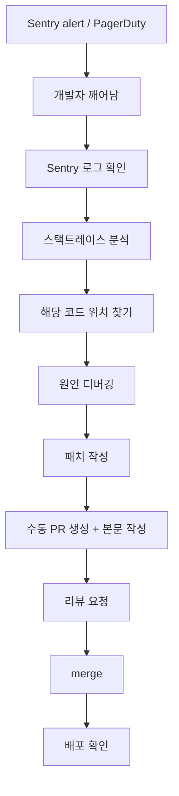
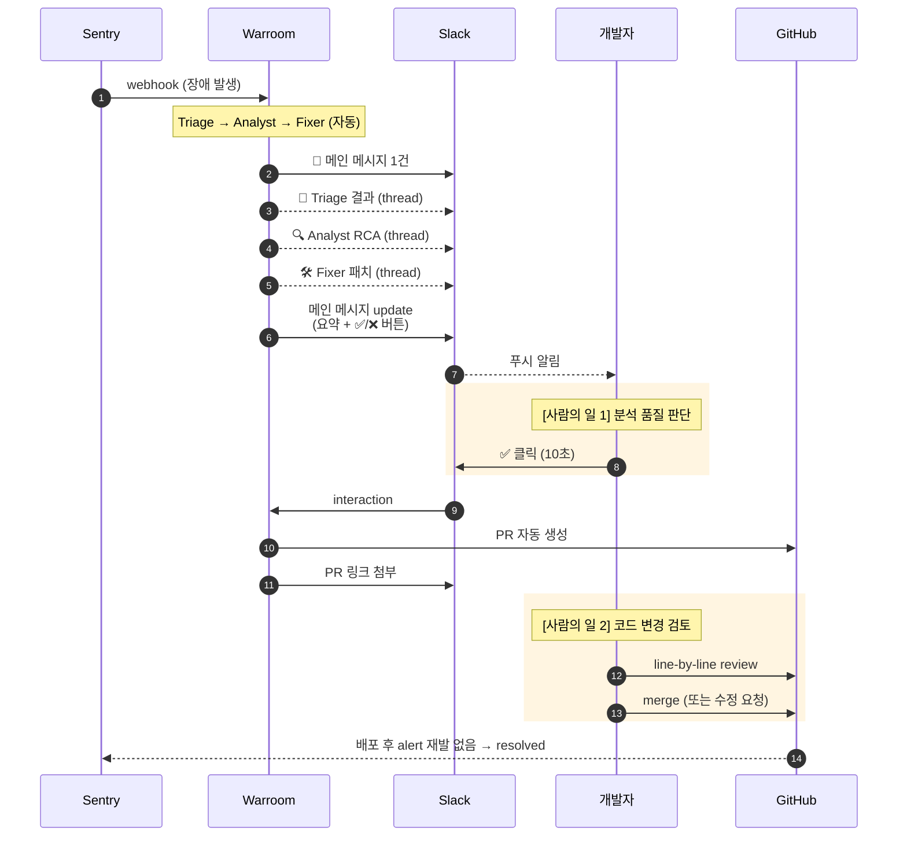
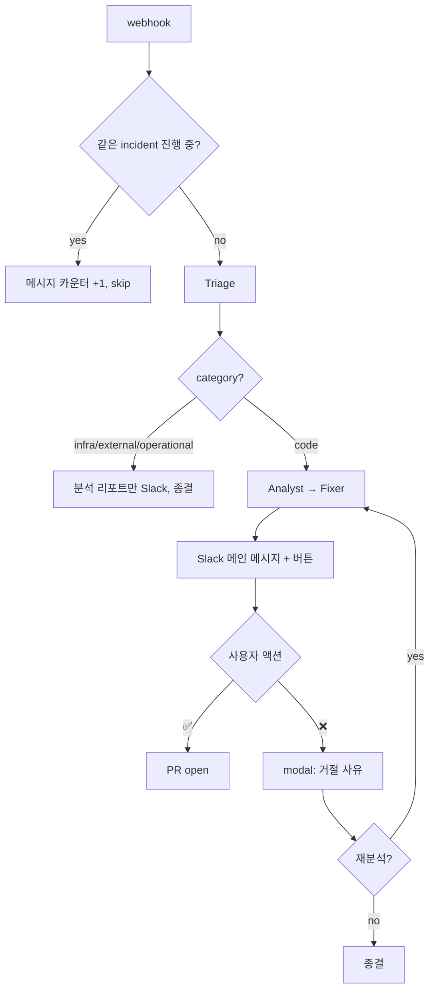
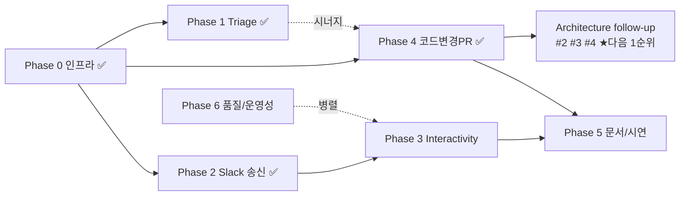

# Warroom 구현 플랜

> 장애 자동 대응 시스템의 최종 비전, 사용자 시나리오, 현재 구조에서 변경 필요한 부분, 단계별 작업 계획.
>
> 최초 작성: 2026-05-13 / 최근 갱신: 2026-05-18 (Phase 3 PR 오픈) / 갱신 정책: Phase 완료 시마다 진행 상태 업데이트.

---

## 0. 현재 위치 / 다음 액션 (sticky)

> **새 세션이 가장 먼저 볼 영역.** Phase 완료 / 우선순위 변경 시 즉시 갱신.

- **진행 중**: **Phase 3 (Slack Interactivity) PR 오픈 + cold review 대기** — 6 commits on `feat/phase-3-slack-interactivity`. `/slack/interactions` endpoint (block_actions + view_submission), verify_slack_signature (v0 HMAC + 5분 replay 윈도우), SlackNotifier.open_reject_modal, incidents.rejection_reason 컬럼 + Alembic, handle_decision(rejection_reason). 198 tests pass (170 → 198, +28)
- **이전 완료**: Convention codify + clients/ 그룹핑 (PR #9). PR reliability (PR #8). Architecture follow-up (PR #6). Phase 4 (PR #1)
- **모든 follow-up 이슈 closed**: #2 #3 #4 #5 #7 (5건). Phase 4 후속 architectural debt 정리 완료
- **다음 1순위 (Phase 3 머지 후)**: **Phase 4.0 / 6.2** — Mock → Real Sentry/GitHub tool. demo 흐름은 mock 으로 작동하나 LLM 분석 품질 ↑ 필요
- **다음 2순위**: **Phase 6.1** — `print` → `logging` 마이그레이션. `[WARROOM][cleanup]` / `[WARROOM][open_pr]` / `[WARROOM][slack]` / `[pr_builder][ORPHAN]` 같은 prefix 패턴이 누적되어 logger 도입 ROI 큰 시점
- **Phase 3 follow-up 후보**: 재분석 요청 hook (저장된 rejection_reason 을 컨텍스트로 orchestrator 재실행) — Phase 3.5 의 "재분석 시 컨텍스트 주입" 부분, 현재 시스템에 재분석 자체가 없어 별도 이슈로 분리 예정
- **사용자 명시 deferred**: weekly report (사용자가 "리포트는 잠시 대기" 라고 함 — 신호 받을 때까지 대기)

---

## 1. 목적

장애 발생 → 알림 → 분석 → 패치 → 승인 → 배포까지 자동화하되, **사람의 일을 "판단" 두 번으로 제한**한다.

1. **분석 품질 판단** — _"AI 분석이 그럴듯한가?"_ (Slack ✅/❌, 10초)
2. **코드 변경 검토** — _"이 코드 변경이 안전한가?"_ (GitHub PR review, 수 분)

코드 작성·RCA 문서화·PR 본문 작성·배포 트리거는 모두 자동.

---

## 2. 사용자 시나리오 (자동화 완료 후)

### 2.1 Before — 기존 수동 대응

사람 작업 시간: **30분 ~ 수 시간** (코드/RCA/PR 본문 모두 사람 몫).

### 2.2 After — Warroom 자동화

### 2.3 시간축 / 책임 분리

| 시점 | 누가 | 무엇 | 자동/수동 |
|---|---|---|---|
| T+0s | Sentry | 장애 감지 | 자동 |
| T+1s | Gateway | webhook 수신, 202 응답 | 자동 |
| T+5s | Slack | 메인 알림 메시지 | 자동 |
| T+10~60s | Orchestrator → Slack | 에이전트 분석 (thread 진행 표시) | 자동 |
| T+60~90s | Slack | 메인 메시지 update (버튼 추가) | 자동 |
| T+? | **개발자** | **Slack ✅/❌ 클릭** | **수동 (10초)** |
| +5s | GitHub | PR 자동 생성 | 자동 |
| T+? | **개발자** | **GitHub PR 리뷰 + merge** | **수동 (~수 분)** |
| +배포 시간 | CI/CD | 배포 | 자동 (Actions) |
| +N분 | Warroom | metric 회복 확인 → resolved | 자동 (M4+ 범위) |

### 2.4 분기 처리 (edge case)

---

## 3. 현재 구조에서 변경 필요한 부분

| # | 시나리오 단계 | 현재 구현 | 변경 필요 | 변경 위치 | Phase |
|---|---|---|---|---|---|
| 1 | 장애 webhook 수신 | `/webhook/{sentry,datadog}` 동작 | dedupe (fingerprint) 추가 | `gateway/services/ingest.py`, `infrastructure/db/repository.py` | 1.1 |
| 2 | Triage 분류 | severity 만 | `category` 필드 추가 (code/infra/external/operational) | `common/models.py`, `orchestrator/agents.py` prompt, `runner.py` 파싱 | 1.2 |
| 3 | infra/external 분기 | Fixer 까지 항상 진행 | category != code 시 Fixer skip, 분석 리포트만 알림 | `orchestrator/runner.py` | 1.3 |
| 4 | Slack 메인 메시지 송신 | Incoming Webhook (단방향) | Web API (`chat.postMessage`, Bot Token) | `chatops/slack.py` 재작성 | 2.1 |
| 5 | 에이전트 진행 표시 | `on_agent_update` 가 Slack 무시 | thread reply 로 표시 | `chatops/slack.py` | 2.2 |
| 6 | 최종 결과 메시지 | 신규 메시지 1건 | 메인 메시지 `chat.update` + 버튼 | `chatops/slack.py` | 2.3 |
| 7 | thread_ts 보관 | 없음 | IncidentRepository 에 컬럼 추가 | `gateway/infrastructure/db/models.py` | 2.4 |
| 8 | Slack 버튼 클릭 | ✅ `/slack/interactions` (block_actions) → handle_decision | — | `gateway/api/slack.py`, `services/decisions.py` | 3.2-3 ✅ |
| 9 | 거절 사유 캡쳐 | ✅ Slack modal (views.open) → view_submission → `incidents.rejection_reason` 영속화 | 재분석 hook (재실행 시 컨텍스트 주입) — 별도 follow-up | `chatops/clients/slack.py:open_reject_modal`, `gateway/api/slack.py`, `repository.update_status` | 3.4-5 ✅ |
| 10 | PR 내용 | ✅ unified diff hybrid (코드 diff + `incidents/<id>.md`) | — | `common/diff.py`, `github/app.py:_apply_diff_pr` | 4.1-3 ✅ |
| 11 | PR cleanup | ✅ 반려 시 PR close + branch 삭제 | — | `github/app.py:close_pr`, `gateway/services/decisions.py:_close_pr_if_exists` | 4.4 ✅ |
| 12 | Incident resolved 자동 전이 | 없음 | metric 회복 확인 (범위 밖, 명시만) | architecture 문서 | 5.1 |

**본 프로젝트 범위 밖 (문서에만 명시)**:
- 영구 운영 환경 호스팅 (Heroku/Fly.io/VPS) — 시연은 ngrok 으로
- 멀티 테넌시 / org 분리
- Rate limiting / abuse 방어
- HTTP `/approve` endpoint 인증 — Slack Interactivity 가 메인 경로가 되므로 HTTP 는 dev 한정
- Sentry `issue.resolved` 역방향 webhook — metric 검증으로 대체

**현재 즉시 사용 가능 (변경 없이 시연 가능)**:
- Sentry/Datadog webhook 수신, 서명 검증, `IncidentEvent` 파싱, fingerprint dedupe
- Triage/Analyst/Fixer LLM 파이프라인 + category 분기 (Gemini Free 검증 완료)
- Slack Bot Token outbound (`chat.postMessage` + thread reply + `chat.update`)
- GitHub App 으로 **unified diff PR** (코드 변경 + 분석 리포트 hybrid) — markdown 폴백 자동
- 반려 시 PR close + branch 자동 삭제
- LLM 출력 secret 패턴 redaction (9개 패턴, consumption 지점 단속)
- HITL 승인 (HTTP `/approve` 로 — Slack 버튼은 Phase 3)
- MySQL/SQLite 인시던트 영속화 (PR 정보 포함), dry-run 폴백, 144개 테스트

---

## 4. 작업 단계

### Phase 0 — 인프라 준비 (사용자 작업, 코드 변경 없음)

| | 항목 | 상태 |
|---|---|---|
| 0.1 | Slack 워크스페이스 + App (Bot Token, Signing Secret) | ✅ workspace `warroom-rau5755`, `auth.test` 통과 |
| 0.2 | Sentry SaaS Free + Internal Integration + Alert Rule | ✅ HMAC 서명 검증 + E2E webhook 통과 |
| 0.2b | ngrok static domain (Sentry → 로컬 gateway) | ✅ `limelight-aneurism-thrive.ngrok-free.dev` |
| 0.3 | GitHub App + 데모 레포 install + private key | ✅ JWT → installation token + repo 접근 |
| 0.4 | (선택) Anthropic 잔액 충전 — 시연 직전 | ⬜ Gemini Free 로 우선 진행 |

부산물: Phase 0.2 검증 중 발견된 버그 — Sentry Internal Integration 의 서명 헤더는 `Sentry-Hook-Signature` 인데 코드는 `X-Sentry-Signature` 로 읽고 있어 401. 별도 fix commit (`ecb1182`).

### Phase 1 — Triage 단단하게 (완료)

- **1.1** ✅ Fingerprint dedupe — 같은 issue_id 처리 중이면 카운터만 +1
- **1.2** ✅ Triage 출력에 `category` 필드 (code/infra/external/operational)
- **1.3** ✅ category != code 시 Fixer skip, 분석 리포트만
- **1.4** ✅ 테스트 보강
- **1.5** ✅ Sentry/Datadog webhook 서명 검증 (signing secret 환경변수)
  - 대안 아키텍처: 내부망 한정이면 mTLS / bearer token 으로 대체 가능. Slack 경유(Sentry→Slack→우리)는 데이터 충실도/latency/의존성 측면에서 권장 안 함

### Phase 1.6 — 구조 정리 (완료)

- **1.6.1** ✅ 테스트를 패키지별 디렉토리로 이동 (hybrid)
- **1.6.2** ✅ SQLAlchemy 2.0 모델 (Incident, Report)
- **1.6.3** ✅ Alembic 도입 + 초기 revision
- **1.6.4** ✅ `DATABASE_URL` 환경변수 분기
- **1.6.5** ✅ store.py async SQLAlchemy 포팅 (`threading.Lock` 제거)
- **1.6.6** ✅ docker-compose.yml (MySQL 8.0)
- **1.6.7** ✅ 테스트 async + in-memory SQLite fixture
- **1.6.8** ✅ README / .env.example / docs

환경 매트릭스:

| 환경 | DB | 이유 |
|---|---|---|
| Test (unit) / CI | `sqlite+aiosqlite:///:memory:` | 빠름, 격리, 셋업 zero |
| Local dev | `mysql+asyncmy://...` (docker-compose) | dev/prod parity, quirk 조기 발견 |
| Demo / 시연 | `mysql+asyncmy://...` | 운영 가정 |
| Alembic migration smoke | MySQL 컨테이너 | `alembic upgrade head` 안전성 검증 |

### Phase 1.7 — 코드 건강성 (완료)

Phase 2 진입 전 long-term maintainability 정리.

- **1.7.1** ✅ `init_schema` 를 SQLite 한정 — MySQL 운영은 `alembic upgrade head` 강제 (사고 가능성 차단)
- **1.7.2** ✅ `.claude/rules/` 신설: `db / testing / async / datetime / lint` 5개 컨벤션 파일 + CLAUDE.md `@import`
- **1.7.3** ✅ `common.clock` 단일 시간 소스 — `APP_TZ=ZoneInfo(env APP_TZ | "UTC")`, `now()` helper. `datetime.now()` 직접 호출 금지
- **1.7.4** ✅ ruff lint(E,F,I,B,UP,SIM,DTZ) + format 전면 적용 — 35 파일 일괄 정리, 47개 deprecation warning → 0
- **1.7.5** ✅ `(str, Enum)` → `StrEnum` 마이그레이션 (Severity/IncidentCategory/IncidentStatus)
- **1.7.6** ✅ pre-commit framework + `ruff-pre-commit` hook — `git commit` 시 자동 강제
- **1.7.7** ✅ docs/decisions.md stale 갱신 (메모리/JSON → SQLAlchemy, 200→202)
- **1.7.8** ✅ `DateTime(timezone=True)` end-to-end — Alembic revision `6afb061f570b`, MySQL 서버/세션 `--default-time-zone=+00:00`, `?init_command=SET%20time_zone%3D...`

### Phase 2 — Slack 가시성 (완료)

- **2.1** ✅ `SlackNotifier` 를 `chat.postMessage` 기반으로 재작성 (Bot Token + Web API)
- **2.2** ✅ 에이전트 진행은 thread reply (`thread_ts` 재사용)
- **2.3** ✅ 최종 결과는 메인 메시지 `chat.update`
- **2.4** ✅ thread_ts 영속화 — `incidents.slack_channel_id` / `slack_ts` 컬럼 + Alembic revision `7efa9d16ece4`
- **2.5** ✅ dry-run (SLACK_BOT_TOKEN 미설정) / 테스트 호환 유지 — 15 unit tests
- **2.6** ✅ `Notifier.on_pipeline_failed(incident_id, error)` 추가
- **2.7** ✅ `_truncate` 를 RCA/patch 에 적용 (section 한도 3000 의 안전버퍼 2500)
- **2.8** ⚠️ **잔무**: 실 LLM patch 가 거의 항상 한도 초과 (실측 patch=3044, RCA=4146). 채널 본문엔 요약+버튼, thread 에 풀텍스트 reply 로 split 필요. DB/PR body 는 풀텍스트 유지 중 (Slack 표시만 잘림 — 데이터 손실 없음)
- **2.9** ⚠️ **잔무**: 실 LLM 경로 (`_run_crew_pipeline`) 에 agent 단위 thread reply emit 누락 — `Crew.kickoff()` 사이에 `notifier.on_agent_update` 수동 호출하거나 CrewAI step callback 사용
- **부수 fix**:
  - `on_incident_received` 가 gateway 에서 한 번도 호출되지 않던 pre-existing 버그 (`4000cfa`)
  - Alembic env.py `%` 인용부호 configparser interpolation ValueError (`26b7d9d`)
  - 드라이버 표기 inconsistency (`aiomysql` → `asyncmy`, `c2feda2`)
  - 테스트 env 누수 차단 강화 (Slack/GitHub vars, `0b6fb39`)

### Phase 3 — Slack Interactivity (PR 오픈, 2026-05-18)

- **3.1** ⬜ Slack App Interactivity URL 등록 (ngrok HTTPS) — 운영 단계, 코드 변경 없음
- **3.2** ✅ `/slack/interactions` endpoint + 서명 검증 — `gateway/api/slack.py` + `verify_slack_signature` (v0 HMAC-SHA256 + 5분 replay 윈도우)
- **3.3** ✅ 버튼 클릭 → `handle_decision` 재사용 — block_actions 의 `warroom_approve` → BackgroundTasks (3초 룰), `warroom_reject` → modal open
- **3.4** ✅ ❌ 클릭 → modal → 거절 사유 캡쳐 — `SlackNotifier.open_reject_modal` (callback_id `warroom_reject_modal`, private_metadata 에 incident_id), view_submission 처리
- **3.5** ✅ 사유 영속화 — `incidents.rejection_reason` 컬럼 + Alembic `6d3aecc468a3` + `handle_decision(rejection_reason=...)`. **재분석 hook 은 별도 follow-up 으로 분리** (현재 시스템에 재분석 자체가 없음)
- **3.6** ✅ 테스트 — verify_slack_signature 단위 7, SlackNotifier modal 3, /slack/interactions 통합 15 = +28 tests (170→198)

### Phase 4 — 실 코드 변경 PR (완료, PR #1 머지 2026-05-18)

**해결한 한계**: PR 에 `incidents/<id>.md` (markdown 리포트) 만 추가했던 기존 흐름을 unified diff hybrid 로 전환. 리뷰어가 GitHub UI 에서 line-by-line review 가능.

- **4.0** ⬜ **Mock → Real tool**: `orchestrator/tools/{sentry,github}.py` 의 mock 함수 → 실 API. **Phase 6.2 로 deferred** (Phase 4 와 분리 — 현재 mock 으로도 diff 적용 흐름은 작동, 분석 품질만 영향)
- **4.1** ✅ Fixer 프롬프트 강제 — unified diff few-shot 예시 + system prompt 명시
- **4.2** ✅ `common/diff.py`: `extract_diff` / `changed_paths` / `is_new_file` / `verify_apply` / `apply_diff` (tempdir + `git apply --check`)
- **4.3** ✅ Apply 흐름: base SHA → 파일 fetch → tempdir apply → blob/tree/commit/ref → PR open (Git Data API 10-call)
- **4.4** ✅ Fallback — diff 추출/검증/적용 실패 시 `DiffApplyError` → markdown-only PR 로 폴백
- **4.5** ✅ 반려 시 `_close_pr_if_exists` — PATCH `/pulls/{n}` + DELETE `/git/refs/heads/{branch}`, 404/422 idempotent
- **4.6** ✅ Hybrid — `changed[f"incidents/{id}.md"] = incident_markdown(report)` 동봉
- **4.7** ✅ Redaction — 9개 secret 패턴 (`common/redact.py`). patch_suggestion 은 diff 구조 보존 위해 consumption 지점에서 redact (Slack/PR body/incident markdown 각각, blob 생성 직전 단속)
- **4.8** ✅ Demo repo `dlwodnjs724/warroom-demo` 에 stripe.py NPE 버그 심기 + 실 PR E2E 검증

**Architecture follow-up (Phase 진입 전 정리 권장)**:
- [#2](https://github.com/dlwodnjs724/warroom/issues/2) — `GitHubAppClient` 책임 분해 (HTTP transport ↔ PR usecase)
- [#3](https://github.com/dlwodnjs724/warroom/issues/3) — gateway GitHub client DI (composition root + `Depends`)
- [#4](https://github.com/dlwodnjs724/warroom/issues/4) — `common/diff.py` 분리 (pure parser ↔ subprocess apply)
- [#5](https://github.com/dlwodnjs724/warroom/issues/5) — `_open_pr` async `to_thread` + `close_pr` observability

### Phase 5 — 문서/시연 + 정리 (1~2시간)

- **5.1** architecture.md 에 incident 라이프사이클 상태 머신
- **5.2** 발표자료에 vision vs 현재 구현 매트릭스
- **5.3** demo 시나리오 1개 — webhook → Slack thread → 클릭 → PR
- **5.4** 본 문서의 사용자 시나리오 다이어그램을 발표 슬라이드로 정리
- **5.5** Startup 시 stale state 복구 — `ANALYZING` 상태로 stuck 된 incident 를 `FAILED` 로 마킹
- **5.6** 통합 테스트 1개 — webhook → /approve → PR dry-run 까지 end-to-end
- **5.7** GitHub Actions CI — pytest + ruff + pre-commit run

### Phase 6 — 코드 품질 / 운영성 정리 (multi-agent 도입 전 정리)

다음 작업들은 데모 임팩트는 없지만 **이후 multi-agent / agent team 작업 진입 전에 정돈해두면 ROI 큰** 항목들. cold-context agent 가 안정적으로 작업하려면 룰 + 일관성이 잡혀 있어야 함.

- **6.1** `print` → `logging` 마이그레이션 — 전 패키지. structured (JSON for prod) vs human (dev) 분기. log level env 제어. 영향 범위: gateway/main, services/*, infrastructure/*, chatops/slack, github/app
- **6.2** orchestrator Sentry/GitHub tool 을 실 API 호출로 교체 — `orchestrator/tools/sentry.py` 가 현재 mock 데이터 하드코딩. Analyst agent 의 분석 품질에 직접 영향. **Phase 4 와 시너지** (실 코드 변경 + 실 Sentry 데이터 = 진짜 분석)

---

## 5. 의존 그래프

---

## 6. 마일스톤 매핑

| 마일스톤 | 범위 | 상태 |
|---|---|---|
| M2b | Phase 0 + Phase 1 | ✅ |
| M3a | Phase 2 (Slack 가시성) + Phase 4 (실 코드 변경 PR) | ✅ 2026-05-18 |
| M3b | Architecture follow-up (#2/#3/#4) + Phase 3 (Slack Interactivity) | ⬜ 진행 예정 |
| M4 | Phase 5 (문서/시연) + 통합 테스트 + 발표 | ⬜ |

---

## 7. 추천 진행 순서

1. ✅ **Phase 1** 부터 (독립적, 안전, vision 완결성에 직접 기여)
2. ✅ 병렬로 **Phase 0** 인프라 셋업 (사용자가 짬짬이)
3. ✅ Phase 0 완료 후 **Phase 2** (Slack 송신 — Bot Token 셋업 1회)
4. ✅ **Phase 4** — 실 코드 변경 PR (unified diff + redaction + reject cleanup, PR #1 머지)
5. **Architecture follow-up** ([#2](https://github.com/dlwodnjs724/warroom/issues/2)/[#3](https://github.com/dlwodnjs724/warroom/issues/3)/[#4](https://github.com/dlwodnjs724/warroom/issues/4)) — cold-context agent 가 새 transport / DI / patcher 추가 위치 명확히 인지하도록 정리
6. **Phase 3** — Slack Interactivity (Approve 버튼 → 자동 PR 흐름의 마지막 piece)
7. **Phase 2.8 / 2.9** — Slack truncation thread split, 실 LLM agent 단위 thread emit (틈틈이)
8. **Phase 6.2 / 4.0** — Mock → Real Sentry/GitHub tool (LLM 분석 품질 ↑)
9. **Phase 5** 문서/시연 + 정리

→ Architecture follow-up 을 Phase 3/6.2 보다 먼저 두는 이유: 새 transport (Slack interactions, 실 Sentry/GitHub) 추가 시점이 임박. 책임 분해/DI 정리가 안 된 상태로 추가하면 `GitHubAppClient` 보일러플레이트가 더 굳어진다.

---

## 8. Agent 활용 지점

운영 룰은 `.claude/rules/agents.md` 단일 소스. 본 문서는 Phase 매핑만:

| 지점 | 상태 |
|---|---|
| **Cold-context review** (non-trivial PR 기본 단계) | ✅ 4회 검증 (PR #1 / #6 / #8 머지 직전) — production-grade finding 매번 |
| Architecture refactor bundle (충돌 매트릭스가 worktree 단일 권장 시) | ✅ 2회 검증 (PR #6 #2/#3/#4, PR #8 #5/#7) |
| Phase 3 (Slack Interactivity) 머지 직전 보안 리뷰 | ⬜ Phase 3 진입 후 (서명 검증·replay 방지·권한 누락 cold review 강점) |
| Phase 5.4 발표자료 다듬기 | ⬜ 본 작업과 독립, 병렬 가능 |

---

## 9. 갱신 로그

→ [docs/plan-log.md](./plan-log.md) 참조 (plan 본문은 토큰 비용 절감을 위해 분리).
