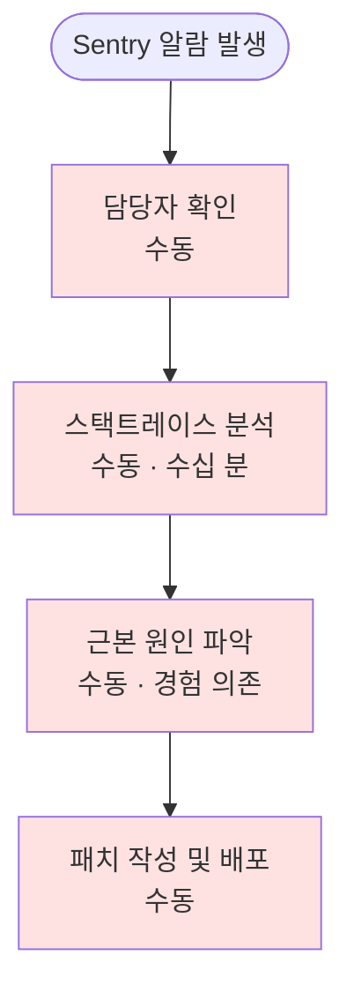
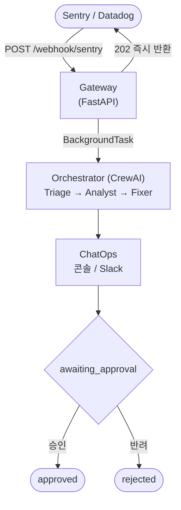
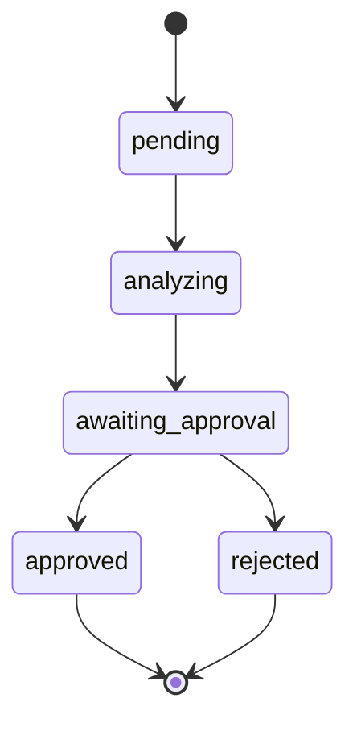

<!-- _class: title -->

# Warroom

## AI Agent 기반 서비스 장애 탐지·대응 자동화 시스템

---

## 목차

1. **배경 및 문제 정의** — 왜 Warroom인가
2. **시스템 개요** — 무엇을 자동화하는가
3. **사용자 및 역할**
4. **핵심 기능**
5. **AI 에이전트 파이프라인**
6. **시스템 아키텍처**
7. **프로토타입 시연**
8. **확장 계획**

---

## 1. 배경 및 문제 정의

### 현재 장애 대응 흐름의 문제



- **MTTD·MTTR** 모두 담당자 역량에 의존
- 야간·주말 장애 시 대응 지연
- 반복되는 장애 패턴에도 체계적 분석 부재

---

## 1. 배경 및 문제 정의

### Warroom이 해결하는 것

| 문제 | Warroom 해결책 |
|------|----------------|
| 알람 → 분석 시작까지 지연 | 웹훅 수신 즉시 AI 파이프라인 자동 실행 |
| 근본 원인 분석의 비일관성 | 5 Whys · Fishbone 방법론 표준화 |
| 패치의 안전성 우려 | Human-in-the-Loop — 개발자 승인 필수 |
| 재발 방지 계획 부재 | Defense in Depth 기반 단기·중기·장기 액션 플랜 자동 생성 |

---

## 2. 시스템 개요



---

## 3. 사용자 및 역할

### 사용자 유형

| 사용자 | 역할 |
|--------|------|
| **SRE / DevOps** | 모니터링 툴에 웹훅 등록, AI 분석 결과 수신·검토 |
| **개발자** | 패치 제안 검토 후 승인 또는 반려 (HITL) |
| **모니터링 도구** | Sentry, Datadog 등 — 장애 감지 시 웹훅 전송 |

---

## 4. 핵심 기능

### 기능 목록

| # | 기능 | 설명 |
|---|------|------|
| 1 | 웹훅 수신 | Sentry 페이로드 파싱, 즉시 202 반환 |
| 2 | AI 분석 파이프라인 | Triage → Analyst → Fixer 순차 실행 |
| 3 | 근본 원인 분석 | 5 Whys + Fishbone + 증거 레벨 명시 |
| 4 | 패치 제안 | 즉시 적용 코드 + 포스트모템 초안 |
| 5 | HITL 승인 | `/approve` · `/reject` HTTP 엔드포인트 |
| 6 | 상태 관리 | pending → analyzing → awaiting_approval → approved/rejected |

---

## 5. AI 에이전트 파이프라인

### Triage Agent

> SRE 팀의 1차 대응 전문가

- 웹훅 페이로드에서 심각도 분류 (critical / high / medium / low)
- **MTTD 추정** — 감지까지 걸린 시간
- 영향 서비스·사용자 수 추정
- 트리거 후보 이벤트 (배포, 설정 변경 등)

---

## 5. AI 에이전트 파이프라인

### Analyst Agent

> 복잡한 시스템 장애의 근본 원인 추적 전문가

- **Tool 호출**: Sentry Issue Lookup, GitHub Source Lookup
- **5 Whys**: 표면 증상 → "왜?"를 5회 반복 → 근본 원인 도달
- **Fishbone 분류**

| 차원 | 분석 내용 |
|------|-----------|
| Technology | 코드·인프라 결함 |
| Process | 개발·배포 프로세스 부재 |
| People | 리뷰·커뮤니케이션 이슈 |
| Environment | 트래픽·타이밍 조건 |

- 각 근거에 **증거 레벨 명시**: Confirmed / Estimated / Unconfirmed

---

## 5. AI 에이전트 파이프라인

### Fixer Agent

> 시니어 소프트웨어 엔지니어 — 패치 + 포스트모템

**패치 코드 (즉시 적용)**
```python
def charge(self, payment_method, amount):
    self._ensure_client()  # ← 누락된 호출 추가
    return self.client.charges.create(...)
```

**Defense in Depth 재발 방지 계획**

| 시간대 | 레이어 | 액션 |
|--------|--------|------|
| 즉시~1주 | Prevention/Detection | 버그 수정 배포, 알람 임계값 강화 |
| 1~4주 | Prevention/Response | PR 체크리스트, 카나리 배포 |
| 1~3개월 | Recovery | 자동 롤백, 린터 룰 |

---

## 6. 시스템 아키텍처

### 기술 스택

| 역할 | 기술 |
|------|------|
| Event Gateway | FastAPI + BackgroundTasks |
| AI Orchestration | CrewAI (Sequential Process) |
| LLM | Anthropic Claude Sonnet 4.6 |
| Package Manager | uv workspace (Python 3.13) |

### 패키지 구조 (Monorepo)

```
packages/
├── common/       # 공유 데이터 모델
├── gateway/      # FastAPI 이벤트 수신
├── orchestrator/ # CrewAI 에이전트 파이프라인
└── chatops/      # Notifier (Console / Slack)
```

---

## 7. 프로토타입 시연

### 시나리오: 결제 서비스 NullPointerException

**1단계 — Sentry 웹훅 수신**

```bash
$ curl -X POST http://localhost:8000/webhook/sentry \
    -H "Content-Type: application/json" \
    -d '{"data":{"issue":{"id":"sentry-demo",
         "title":"NullPointerException at app/gateways/stripe.py"}}}'

{"incident_id": "sentry-demo", "status": "accepted"}
```

Gateway는 즉시 `202 accepted` 반환 → 백그라운드에서 AI 파이프라인 실행

---

## 7. 프로토타입 시연

### 2단계 — AI 파이프라인 자동 실행 (콘솔 출력)

```
============================================================
[WARROOM] 인시던트 수신: sentry-demo
  소스   : SENTRY
  제목   : NullPointerException at app/gateways/stripe.py
============================================================

[WARROOM] 에이전트 파이프라인 시작...
[Triage Agent] 인시던트 심각도 분류 및 타임라인 재구성 중...
[Triage Agent] 초기 브리핑 완료.
[Analyst Agent] Sentry 스택트레이스 조회 중...
[Analyst Agent] GitHub 커밋 이력 조회 중...
[Analyst Agent] 5 Whys / Fishbone 분석 중...
[Analyst Agent] 근본 원인 분석 완료.
[Fixer Agent] 패치 코드 및 재발 방지 계획 수립 중...
[Fixer Agent] 패치 코드 및 포스트모템 초안 완료.
```

---

## 7. 프로토타입 시연

### 3단계 — 분석 결과 확인 (API 응답)

```bash
$ curl http://localhost:8000/incidents/sentry-demo
```

```json
{
  "incident_id": "sentry-demo",
  "status": "awaiting_approval",
  "report": {
    "severity": "high",
    "triage_summary": "- 심각도: HIGH\n- 영향 사용자: 약 312명\n- MTTD 추정: 약 2분\n- 트리거: 03:10 UTC 배포 (커밋 abc1234)",
    "patch_suggestion": "def charge(self, ...):\n    self._ensure_client()  ← 누락된 호출 추가\n    ...",
    "is_approved": null
  }
}
```

---

## 7. 프로토타입 시연

### 4단계 — HITL 승인

```bash
$ curl -X POST http://localhost:8000/incidents/sentry-demo/approve

{"incident_id": "sentry-demo", "status": "approved", "action": "승인"}
```

**인시던트 상태 전이**



---

## 8. 확장 계획

### 단기 확장 (즉시 적용 가능)

| 항목 | 방법 |
|------|------|
| Slack 알림 | `chatops/slack.py` — `Notifier` ABC 구현 |
| Datadog 웹훅 | `gateway/parsers/datadog.py` 추가 |
| 실제 Sentry API | `orchestrator/tools/sentry.py` Mock 교체 |

### 중장기 확장

| 항목 | 방법 |
|------|------|
| RDB 저장 | `gateway/store.py` `IncidentStore` 교체 |
| Jira 티켓 자동 생성 | approve 핸들러에 Jira API 연동 |
| 실제 GitHub API | PR 자동 생성까지 연동 |
| 다중 LLM 지원 | CrewAI LLM 파라미터 교체 |

---

<!-- _class: title -->

# 감사합니다

**Warroom** — AI가 장애를 분석하고, 사람이 결정한다

github.com/dlwodnjs724/warroom
