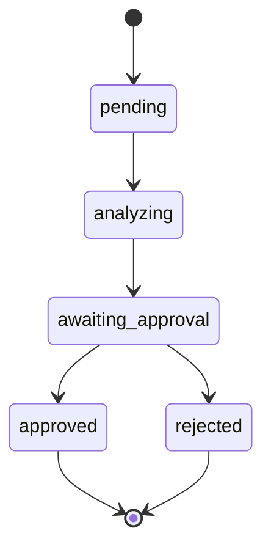
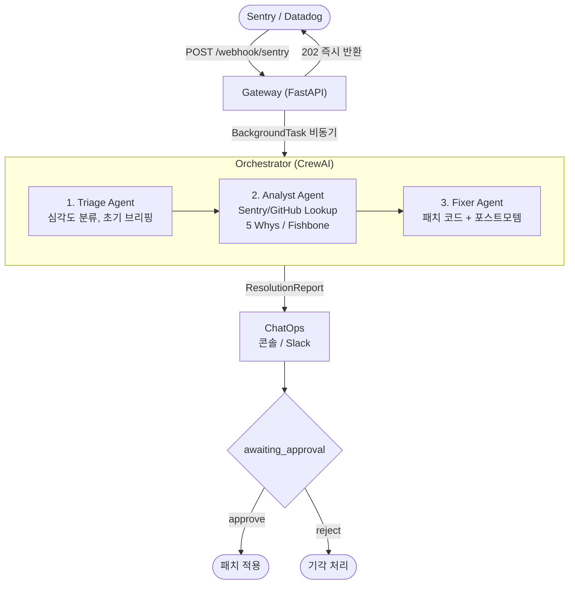
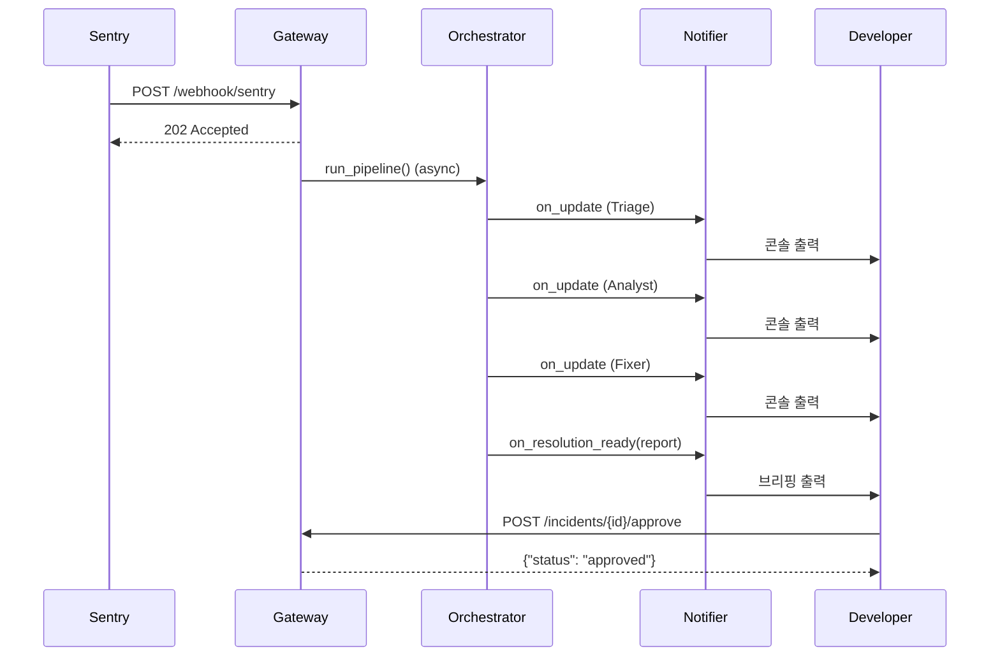

# Warroom — 업무설명서

> AI Agent 기반 서비스 장애 탐지·대응 자동화 시스템  
> 작성일: 2026-04-09

---

## 1. 시스템 개요

서비스를 운영하다 보면 Sentry나 Datadog 같은 모니터링 도구가 장애 알람을 보내온다. 문제는 그 다음이다. 담당자가 직접 스택트레이스를 분석하고, 원인을 추적하고, 패치를 작성하기까지 수십 분에서 수 시간이 소요된다. 야간이나 주말이면 더 길어진다.

**Warroom**은 이 공백을 AI 에이전트가 채운다. Sentry 웹훅을 수신하는 순간 세 개의 AI 에이전트가 순서대로 동작해 심각도를 분류하고, 근본 원인을 분석하고, 패치 코드를 제안한다. 개발자는 최종 결과물을 검토하고 승인 또는 반려만 하면 된다.

### 핵심 가치

| 가치 | 설명 |
|------|------|
| **속도** | 알람 수신 즉시 분석 시작, 수 분 내 패치 제안 도달 |
| **일관성** | 5 Whys · Fishbone 방법론으로 매번 체계적인 근본 원인 분석 |
| **안전** | 개발자 승인 없이 패치가 자동 적용되는 일은 없음 |
| **확장성** | 모니터링 도구, 알림 채널, 저장소를 각각 독립적으로 교체 가능 |

---

## 2. 사용자 및 역할

### 2.1 SRE / DevOps Engineer

Warroom의 주 사용자다. 사용하던 Sentry나 Datadog 설정에 Warroom 웹훅 URL 하나를 추가하는 것으로 연동이 끝난다. 이후 장애가 발생하면 콘솔이나 Slack으로 AI 분석 결과를 수신하고, 내용을 검토한 뒤 승인 또는 반려를 선택한다. 직접 스택트레이스를 파헤치지 않아도 된다.

### 2.2 개발자 (패치 승인자)

AI가 제안한 패치 코드와 포스트모템 초안을 검토하는 역할이다. HTTP 엔드포인트(`/approve`, `/reject`) 또는 CLI로 최종 결정을 내린다. 패치는 반드시 이 승인 단계를 거쳐야만 적용된다.

### 2.3 모니터링 도구 (이벤트 발신자)

Sentry, Datadog 등 기존에 사용 중인 도구가 장애를 감지하면 Warroom Gateway로 웹훅을 전송한다. 별도 설정 없이 웹훅 URL 등록만으로 연동된다.

---

## 3. 주요 기능

### 3.1 장애 알람 자동 수신

Sentry 웹훅이 Warroom에 도달하면, 시스템은 즉시 수신 확인을 반환하고 백그라운드에서 분석을 시작한다. 알람을 보낸 쪽은 Warroom이 분석을 마칠 때까지 기다릴 필요가 없다.

```bash
# 실제 수신 응답 예시
{"incident_id": "sentry-demo", "status": "accepted"}
```

### 3.2 AI 에이전트 3단계 분석

장애 알람이 들어오면 세 개의 AI 에이전트가 순서대로 협력한다.

**Triage Agent** — 첫 번째로 동작한다. 알람 페이로드를 분석해 심각도를 분류하고, 영향 받는 서비스와 사용자 수를 추정하며, 트리거가 된 이벤트(배포, 설정 변경 등)를 찾아낸다.

**Analyst Agent** — Triage 결과를 받아 Sentry 스택트레이스와 GitHub 커밋 이력을 조회한다. 5 Whys 분석으로 "왜?"를 5번 반복해 표면 증상에서 근본 원인까지 파고들고, Fishbone 분류(Technology / Process / People / Environment)로 원인을 입체적으로 정리한다. 각 근거에는 Confirmed / Estimated / Unconfirmed 증거 레벨을 명시한다.

**Fixer Agent** — 분석 결과를 바탕으로 즉시 적용 가능한 패치 코드를 작성하고, 단기·중기·장기 재발 방지 계획을 담은 포스트모템 초안을 생성한다.

### 3.3 패치 제안 및 포스트모템

Fixer Agent가 생성하는 결과물 예시:

```python
# app/gateways/stripe.py — 즉시 패치
def charge(self, payment_method, amount):
    self._ensure_client()  # ← 누락된 호출 추가
    return self.client.charges.create(...)
```

재발 방지 계획은 Defense in Depth 레이어 기준으로 구성된다:

| 시간대 | 레이어 | 예시 액션 |
|--------|--------|-----------|
| 즉시~1주 | Prevention / Detection | 버그 수정 배포, 알람 임계값 강화 |
| 1~4주 | Prevention / Response | PR 체크리스트, 카나리 배포 도입 |
| 1~3개월 | Recovery | 자동 롤백, 린터 룰 추가 |

### 3.4 개발자 승인 (Human-in-the-Loop)

AI 분석이 완료되면 인시던트는 `awaiting_approval` 상태가 된다. 개발자는 결과를 검토한 뒤 승인 또는 반려를 선택한다. 패치는 반드시 이 단계를 거쳐야 적용된다.



### 3.5 인시던트 현황 조회

진행 중인 모든 인시던트의 상태와 분석 결과를 API로 조회할 수 있다.

```bash
# 전체 인시던트 목록
GET /incidents

# 개별 인시던트 상세 (분석 결과 포함)
GET /incidents/{id}
```

---

## 4. 시스템 흐름도



### 시퀀스 다이어그램



---

## 5. 패키지 구조

```
warroom/
├── packages/
│   ├── common/          # 공유 데이터 모델
│   │   └── common/models.py   # IncidentEvent, ResolutionReport, Severity
│   │
│   ├── gateway/         # 이벤트 수신 레이어
│   │   ├── gateway/main.py    # FastAPI 앱, 엔드포인트
│   │   ├── gateway/store.py   # 인메모리 인시던트 저장소
│   │   └── gateway/parsers/
│   │       └── sentry.py      # Sentry 페이로드 파서
│   │
│   ├── orchestrator/    # AI 파이프라인 레이어
│   │   ├── orchestrator/agents.py   # Triage / Analyst / Fixer
│   │   ├── orchestrator/runner.py   # 파이프라인 실행 (mock/real)
│   │   └── orchestrator/tools/
│   │       ├── sentry.py            # Sentry Issue Lookup 툴
│   │       └── github.py            # GitHub Source Lookup 툴
│   │
│   └── chatops/         # 알림 레이어
│       ├── chatops/base.py     # Notifier ABC
│       └── chatops/console.py  # ConsoleNotifier 구현
│
├── serve.py    # 서버 엔트리포인트
└── demo.py     # CLI 데모 엔트리포인트
```

---

## 6. 기술 스택

| 역할 | 기술 |
|------|------|
| Event Gateway | FastAPI + BackgroundTasks |
| AI Orchestration | CrewAI (Sequential Process) |
| LLM | Anthropic Claude Sonnet 4.6 |
| Package Manager | uv workspace (Python 3.13) |

---

## 7. 확장 포인트

| 항목 | 위치 | 방법 |
|------|------|------|
| Datadog 웹훅 지원 | `gateway/parsers/datadog.py` | `parse()` 동일 인터페이스 구현 |
| Slack 알림 | `chatops/slack.py` | `Notifier` ABC 구현 |
| RDB 저장 | `gateway/store.py` | `IncidentStore` 클래스 교체 |
| Jira 티켓 자동 생성 | `gateway/main.py` approve 핸들러 | TODO 위치 참고 |
| 실제 Sentry API | `orchestrator/tools/sentry.py` | Mock 함수 교체 |
| 실제 GitHub API | `orchestrator/tools/github.py` | Mock 함수 교체 |
